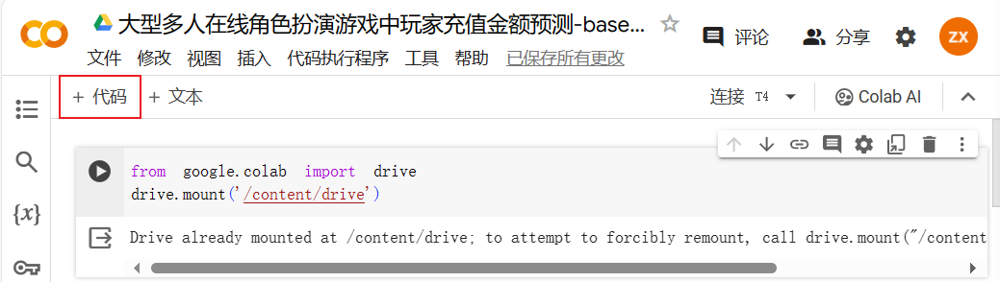
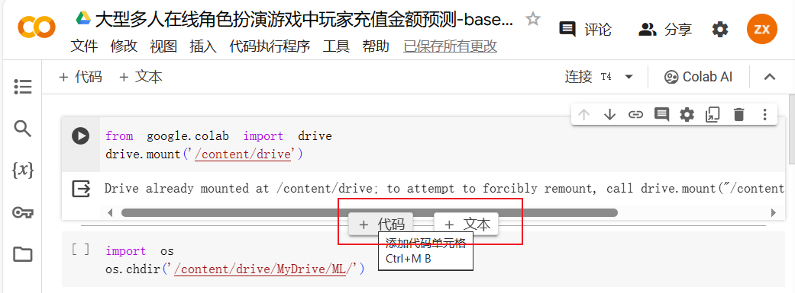
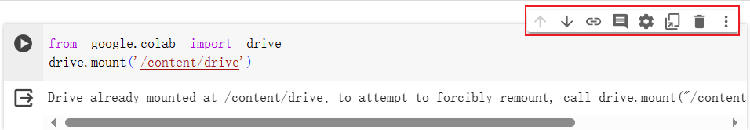
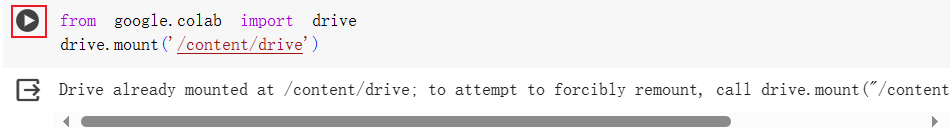
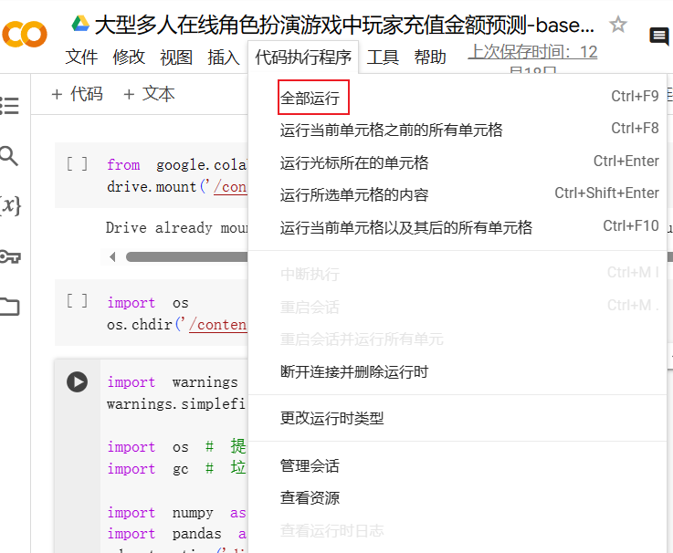
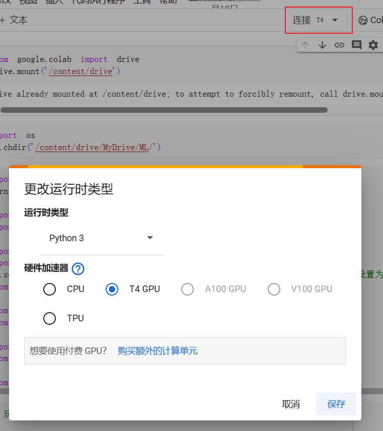

# Google Colab Guide

## (又名: 开发环境速通指南🤗)

## Colab简介

- **云端服务**: Google提供的基于云端的Jupyter笔记本(Python+markdown，且可以分代码块运行Python)服务。
- **免费使用**: 用户可以免费使用Colab，并白嫖GPU资源。
- **开箱即用**: 已经安装好了一些常用的库，启动就完事了。
- **Google Drive集成**: 方便地与Google Drive集成，轻松保存和分享笔记本文件。

## 注意事项

* 先注册Google账号喵(看教程喵，不然容易失败喵[怎么注册Google账号（使用国内手机号注册）_怎么注册谷歌账号用国内手机-CSDN博客](https://blog.csdn.net/qq_58035032/article/details/130402279)
* 每日限额为12h
* 免费版云端资源不足时随时可能，请注意随时保存文件
* 离开网页时也会被关闭，请先保存

---

在使用Colab时，你可能需要了解:

## 代码块

* 添加

  

  (或鼠标移动到两代码块中间)

* 移动、删除

  

## 使用Jupyter运行代码

* 点击代码块左侧按钮运行对应代码块

  

* 代码执行程序中可以全部运行

  

## 使用GPU

* 更改运行时类型

  

## 库文件

* 大部分常见的库已经安装好了(baseline中的库)

* 需要安装的库使用以下语句

  ```python
  !pip install <package>
  ```

## 文件

* 挂载Google Drive

  ``` python
  from google.colab import drive
  drive.mount('/content/drive')
  ```

  云盘将被挂载到/content/drive

* 更改目录

  ```Python
  import os
  os.chdir('<dir>')
  ```

  文件结构自己整理哈

* 上传数据集

  建议上传压缩包，Google Drive上传速度只有500K左右，源文件较大(关于上传速度的问题网上有解决办法可以自行了解)

  之后再Jupyter内进行解压

  ```python
  !unzip './DataSet.zip' -d './datasets/'
  ```

  也可以保存我分享的数据集文件，已上传至Google Drivehttps://drive.google.com/drive/folders/1-sUuU6U8Alz1EQYUIQbaaeSJbqor1zmc?usp=drive_link

## Baseline

对baseline进行了关于路径的修改，使其能运行在Colab中(同时修复了一些lightGBM库更新导致的参数问题)

Google Drive链接https://drive.google.com/file/d/1cUSy1Yab9IdpMA3YZHGtozhC0BtQbrjn/view?usp=drive_link

